#### A note on crime data:

Not all cities name or keep track of crime data in similar ways.

Not all cities call crime data in the same way.

Risk factors are case specific, what works for one city at one time doesn't work for another.


## <ins> RTM Software </ins>

Important things to know about RMT software:

- If the model doesn't find risk factors relevant (correlative), the analysis will omit them.

- Use NAD 1983 State Plane projection, otherwise the software won't identify the unit of analysis. For information on coordinate systems click [here](https://epsg.io/)


### <ins> Steps </ins>

1. Read in boundary shapefile


2. Clean up crime data (historic complaint datasets). Select year and type of crime.


3. Prepare data for temporal heat map


4. Read in / process built environment data


5. Make sure everything is in the right projection


6. Clip features within boundary


7. Export to shapefile and review in Qgis


8. Get features from existing vector data or Google Earth Pro. Instructions [here](https://www.riskterrainmodeling.com/blog/risk-factors-for-those-in-need-of-risk-factors) 


9. _Optional_ Open R, import klm to create shp. Or leave as is, RTM software reads in klm/kmz files


10. Make sure everything is in the right projection!!


11. Load into RTM software.


## <ins> Examples </ins>

### <ins> RTM for NYC, Brooklyn 2007 </ins>


##### For specifics on how to create images, deal with the data in a more granular way, see `scripts` within the USF package. **#_rename folder_**


Load libraries

```{r eval=FALSE, include=TRUE}
library(USF)
library(tidyverse)
library(readr)
library(lubridate)
library(writexl)
library(chron)
library(sp)
library(sf)
library(pivottabler)
library(here)
library(ggplot2)
library(gridExtra)
```


### 1. Boundary


Load boundary shapefile ([Source](https://data.cityofnewyork.us/City-Government/Borough-Boundaries/tqmj-j8zm))

```{r eval=FALSE, include=TRUE}
brooklyn <- st_read(here("boroughboundary.shp")) %>%
  filter(boro_name == "Brooklyn") %>% # filter for Brooklyn
  # st_transform(., crs = 2260) # keep original projection _need to double check error_
```

### 2. Crime data


Load historic crime data (NYPD complaints) ([Source](https://data.cityofnewyork.us/Public-Safety/NYPD-Complaint-Data-Historic/qgea-i56i))

```{r eval=FALSE, include=TRUE}
nychcrime <- read.csv("~/Clark/RA-ing/SummerInstitute/GIS/nyc/NYPD_Complaint_Data_Historic.csv") %>%
  filter(!Latitude %in% NA | !Longitude %in% NA) %>% # remove NA values
  as.data.frame(.) %>%
  st_as_sf(., coords = c("Longitude", "Latitude"), crs = 9001) %>% # to match brooklyn
  rename(., c( "Full_Date" = "CMPLNT_FR_DT", "Time" ="CMPLNT_FR_TM")) # rename columns

st_crs(nychcrime) <- st_crs(brooklyn) # make sure both are in the same projection
```

Extract data within Brooklyn for year = 2007. In this NYPD complaints dataset the year is not an independent field but is found within the `Full_Date` variable. 

```{r eval=FALSE, include=TRUE}
nychcrime$Full_Date %>% head()

# [1] "12/31/2019" "12/29/2019" "12/15/2019" "12/28/2019" "09/05/2008" "12/27/2019"
```

To filter by year we need to create a new column and populate it with year information.

```{r eval=FALSE, include=TRUE}
bk07crime <- nychcrime %>% filter(BORO_NM == "BROOKLYN") %>% # extract Brooklyn data
  separate(Full_Date, into = c("Month", "Day", "Year"), # separate field Full_Date into new columns
           sep = "/", remove = FALSE) %>% 
  filter(Year == "2007") # extract 2007 data
```

We'll select "ASSAULT 3" as the crime to be tested, but first make sure all points fall within Brooklyn.

```{r eval=FALSE, include=TRUE}
bk07assault <- bk07crime %>% filter(PD_DESC == "ASSAULT 3") # select crime

bk07assault_clip <- bk07assault[brooklyn, ] # select points within polygon

bk07assault_clip <- bk07assault_clip[-c(3:4, 6:13, 14:18, 21:31,34:36)] # drop unwanted columns

# > colnames(bk07assault_clip)
# [1] "CMPLNT_NUM"    "Date"          "Year"          "Time"          "PREM_TYP_DESC"
# [6] "JURIS_DESC"    "PATROL_BORO"   "STATION_NAME"  "geometry"  
```


```{r, out.width = "100%", echo=FALSE, fig.align='center'}
options(knitr.graphics.error = FALSE)
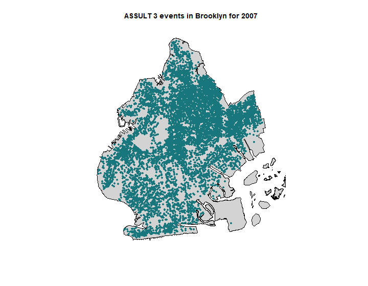
```


### 3. Temporal heatmap


For temporal heat map for <ins>_all_</ins> crime ([RTM how to here](http://www.riskterrainmodeling.com/uploads/2/6/2/0/26205659/tempheatmap_tutorial.pdf))

```{r eval=FALSE, include=TRUE}
heatmap07 <- bk07crime %>% 
  mutate(timestamp = paste(Full_Date, Time)) %>% # create new column with date and time
  mutate(date1 = strptime(.$timestamp, format = "%m/%d/%Y %H:%M:%S")) %>% # format to timestamp
  mutate(DayFormat = weekdays(date1)) %>% # transform date to Weekdays
  mutate(DayFormatText = as.character(DayFormat)) %>%
  mutate(HourFormat = hour(date1)) # transform time to 0-23 hour of the day
```

Create pivot table **_small zoom, fix!_**

```{r eval=FALSE, include=TRUE}
hmtable07 <- t(table(heatmap07$DayFormatText, heatmap07$HourFormat)) # pivot count and day

heatmap07$DayFormatText <- factor(heatmap07$DayFormatText, # Reorder factor levels by day of the week
  levels= c("Sunday", "Monday", "Tuesday", "Wednesday", "Thursday",
            "Friday", "Saturday"))
```

```{r, out.width = "100%", echo=FALSE, fig.align='center'}
options(knitr.graphics.error = FALSE)
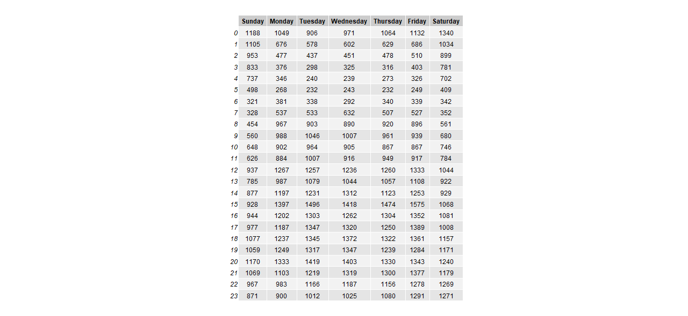
```

Add colour to reveal heatmap 

**_don't know how to export as png. Clipped from opening in browser_**

```{r, out.width = "50%", echo=FALSE, fig.align='center'}
options(knitr.graphics.error = FALSE)
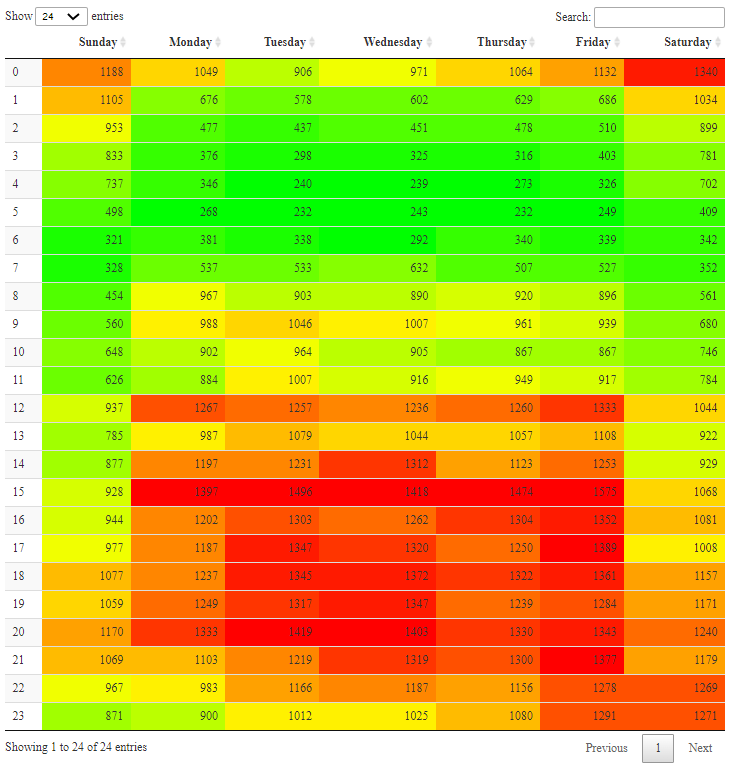
```


### 4. Risky locations

For ASSAULT 3, use `PREM_TYP_DESC` to get a sense of what locations appear as risky. 


```{r eval=FALSE, include=TRUE}
rtmbk07 <- bk07assault_clip %>% group_by(bk07assault_clip$PREM_TYP_DESC) %>% # group by categories of premises
  count() %>% # frequency per group
  rename(., RTM_factors = "bk07assault_clip$PREM_TYP_DESC", Count = "n") # rename
st_geometry(rtmbk07) <- NULL # drop geometry to make processing easier
rtmbk07 <- rtmbk07 %>% as_tibble() # create table
t <- rtmbk07%>% arrange(-Count) %>% slice(1:10) # arrange highest first, then select top 10 results
```


These are the top 10 locations according to the dataset. Once identified, look for datasets and other spatial data that match the results. Use Google Earth Pro, OpenData portals, Community based datahubs, etc.

```{r, out.width = "100%", echo=FALSE, fig.align='center'}
options(knitr.graphics.error = FALSE)
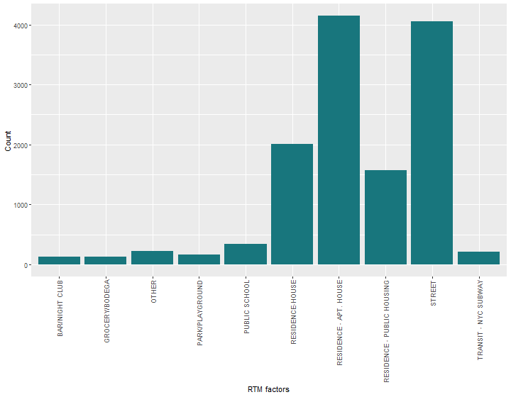
```

To avoid skewed results, we filter out residence, street, and other to see what other built environment options could be classified as risk factors. We select the top 6 places.

```{r eval=FALSE, include=TRUE}
ds07 <- rtmbk07 %>% 
  filter(!RTM_factors %in% c("RESIDENCE - APT. HOUSE", "RESIDENCE-HOUSE", 
                    "RESIDENCE - PUBLIC HOUSING", "STREET", "OTHER", " ")) %>% 
  arrange(-Count) %>% slice(1:6) 
```


```{r, out.width = "100%", echo=FALSE, fig.align='center'}
options(knitr.graphics.error = FALSE)
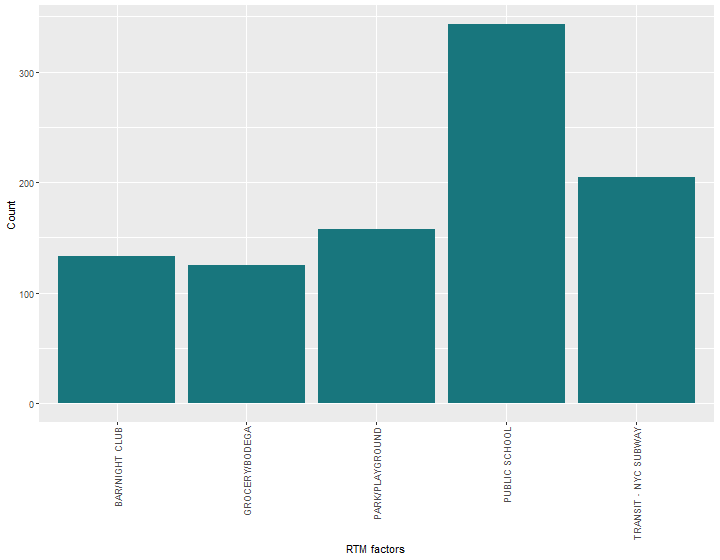
```


### 5. Projections


Project everything to EPSG:2260, NAD83 / New York East (ftUS) and export as shapefile

```{r eval=FALSE, include=TRUE}
brooklyn <- brooklyn %>% st_transform(., crs = 2260)
bk07assault_clip <- bk07assault_clip %>% st_transform(., crs = 2260)
```

Do the same for other data gathered.

### 6. Export


Export to shapefile format. 

This is compatible with QGIs and ArcGis
```{r eval=FALSE, include=TRUE}
st_write(bk07assault_clip,
         here("bk07assault.shp"),
         driver = "ESRI Shapefile")

st_write(brooklyn,
         here("brooklyn.shp"),
         driver = "ESRI Shapefile")

```

### 7. RTM software

Load data to RTM software, run model, get results.


<ins> All Risk Factors Tested:</ins>


```{r, out.width = "90%", echo=FALSE, fig.align='center'}
options(knitr.graphics.error = FALSE)
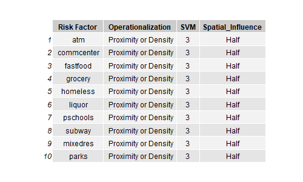
```

<ins>Results</ins>

From the report: 

_"Understand risk factors in the risk terrain model according to the operationalization, spatial_
_influence, and relative risk value (RRV). Interpret RRVs as risk factor weights; places affected_
_by a risk factor with a RRV of 6 are twice as risky compared to places affected by risk factor with a_ 
_RRV of 3. Develop risk narratives for the study topic based on the RTM Results Table._
_You may choose to prioritize the risk factors for mitigation based on the RRVs and/or your risk_
_narratives."_

```{r, out.width = "90%", echo=FALSE, fig.align='center'}
options(knitr.graphics.error = FALSE)
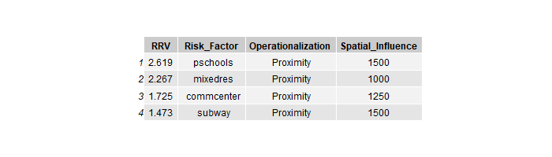
```


#### <ins>Maps</ins>

Priority places as identified by RTM software
```{r, out.width = "100%", echo=FALSE, fig.align='center'}
options(knitr.graphics.error = FALSE)
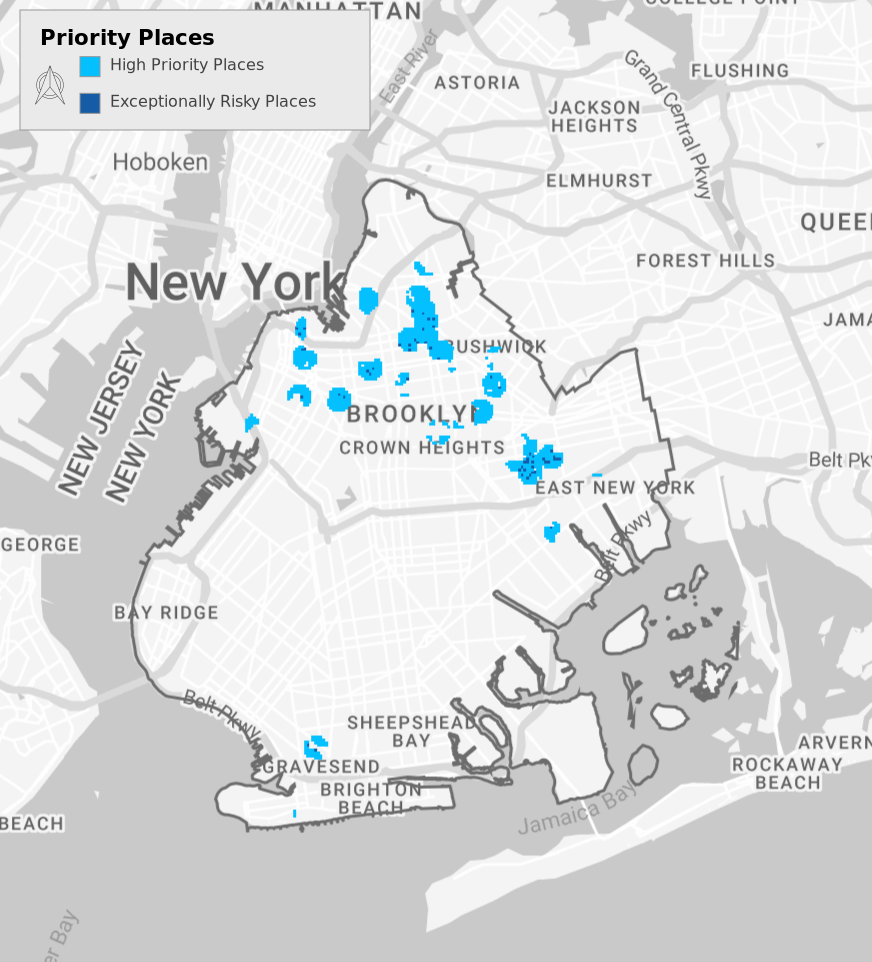
```

Relative risk as identified by RTM software
```{r, out.width = "100%", echo=FALSE, fig.align='center'}
options(knitr.graphics.error = FALSE)
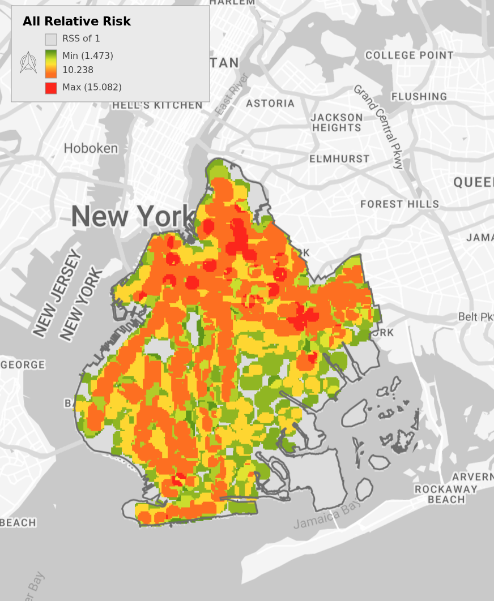
```

Above Average Risk places as identified by RTM software
```{r, out.width = "100%", echo=FALSE, fig.align='center'}
options(knitr.graphics.error = FALSE)
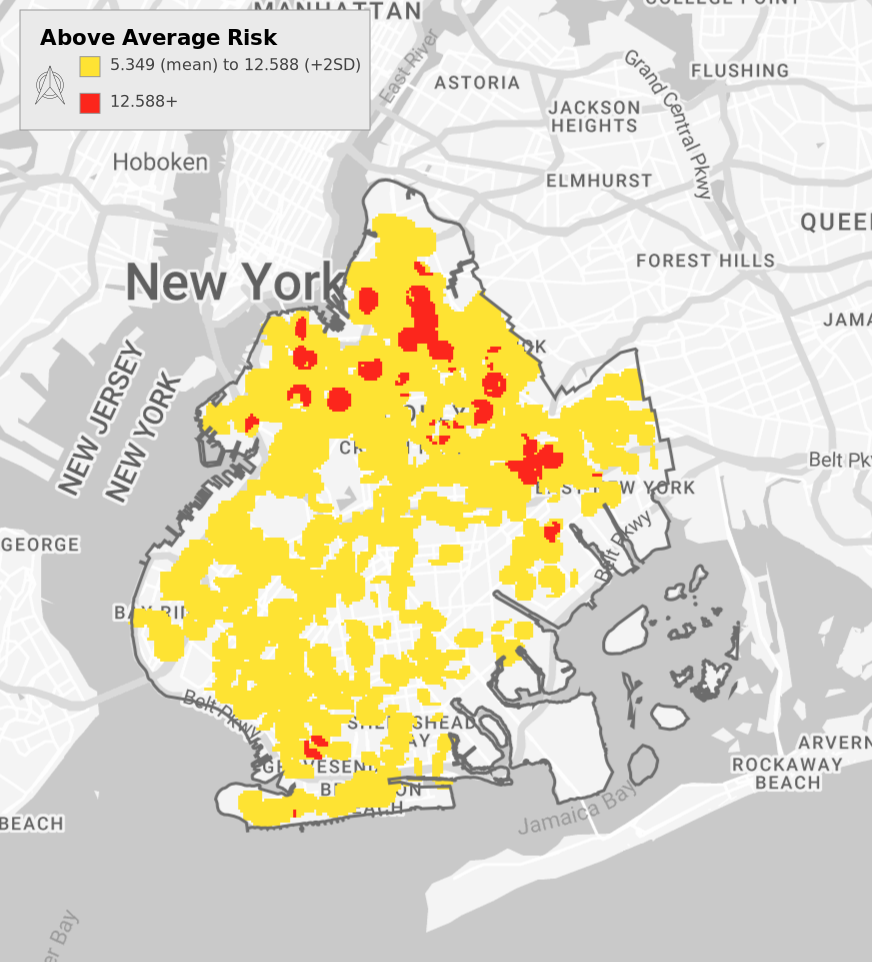
```

Highest Risk places as identified by RTM software
```{r, out.width = "100%", echo=FALSE, fig.align='center'}
options(knitr.graphics.error = FALSE)
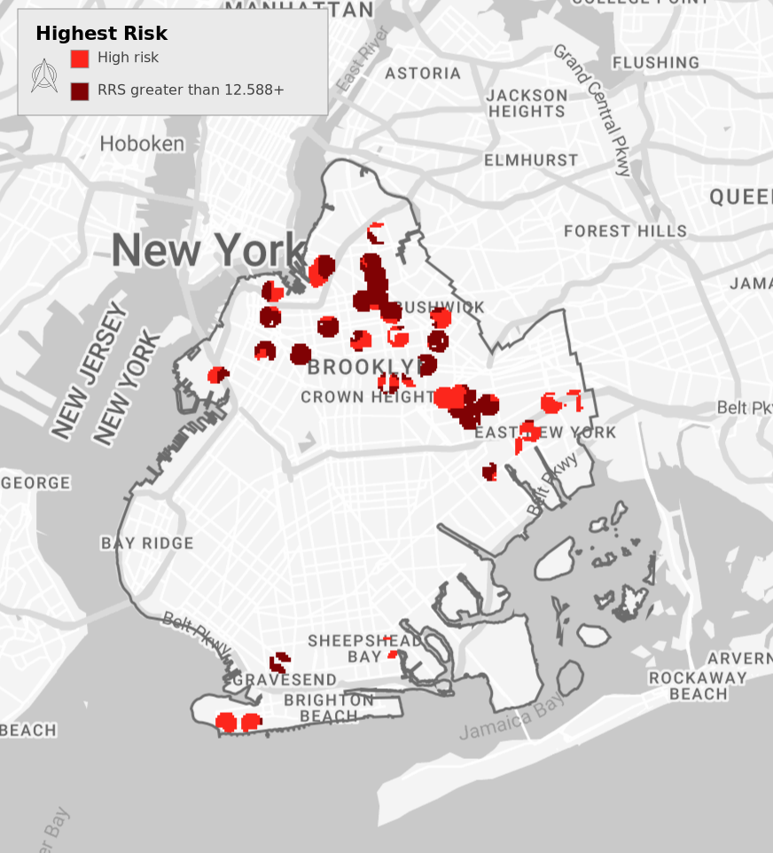
```
