## Guiding questions


- How to spatialize the temporal heatmaps?


- Think through data that might help us answer "what prompts the police surveil some places more the others?"


- Is there a way to link "risky locations" with urban development projects (capital investments, signs of gentrification, etc)?
  + Used Williamsburg and Park Slope and examples, use "risky factors" to track changes in  land use/development sites, etc.
  + Boundary dilemma.


- Create our own crime database.
  + Figure out how informality is coded by the police. 
  + Trace how "everyday risk" is created.


- Go back to the main question: How to map patrol density?
  + stop and frisk data


## Updates


For this leg of the project we decided to switch gears from <span style="color: red;">All crime</span> to <span style="color: red;">Property crime</span>. This meant creating our own property crime variable.


According to the [National Institute of Justice](https://nij.ojp.gov/topics/crime/property-crimes), property crime contemplates:

- burglary

- theft

- vandalism

- arson


### Spatializing heatmaps


Heatmap for property crimes in Brooklyn for 2007. 

```{r, out.width = "65%", echo=FALSE, fig.align='center'}
options(knitr.graphics.error = FALSE)
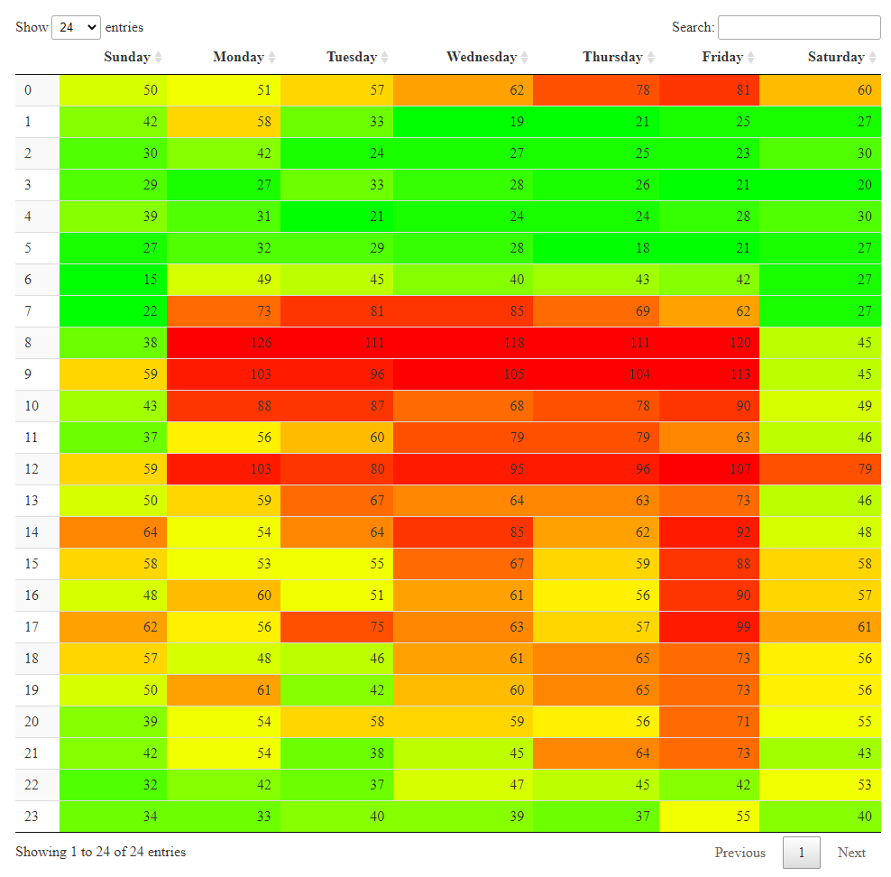
```


Animated temporal heatmap for property crime data in Brooklyn, 2007.


_need to update to reflect boundaries_

```{r, out.width = "100%", echo=FALSE, fig.align='center'}
options(knitr.graphics.error = FALSE)
knitr::include_graphics("figures/daysofweek071.gif")
#knitr::include_graphics("figures/heatmap/bk_propcrime/daysofweek071.gif")

```


### Police routine

From this temporal heatmap, what could be read as key "policing" times? 3pm and 8pm.

```{r, out.width = "50%", echo=FALSE, fig.align='center'}
options(knitr.graphics.error = FALSE)
knitr::include_graphics("figures/heatmap07bk.png")
```


#### Spatial heatmap 3pm

Heatmap for all 3pm crime data in Brooklyn, 2007

```{r, out.width = "100%", echo=FALSE, fig.align='center'}
options(knitr.graphics.error = FALSE)
#knitr::include_graphics("figures/heatmap/15hours.gif")
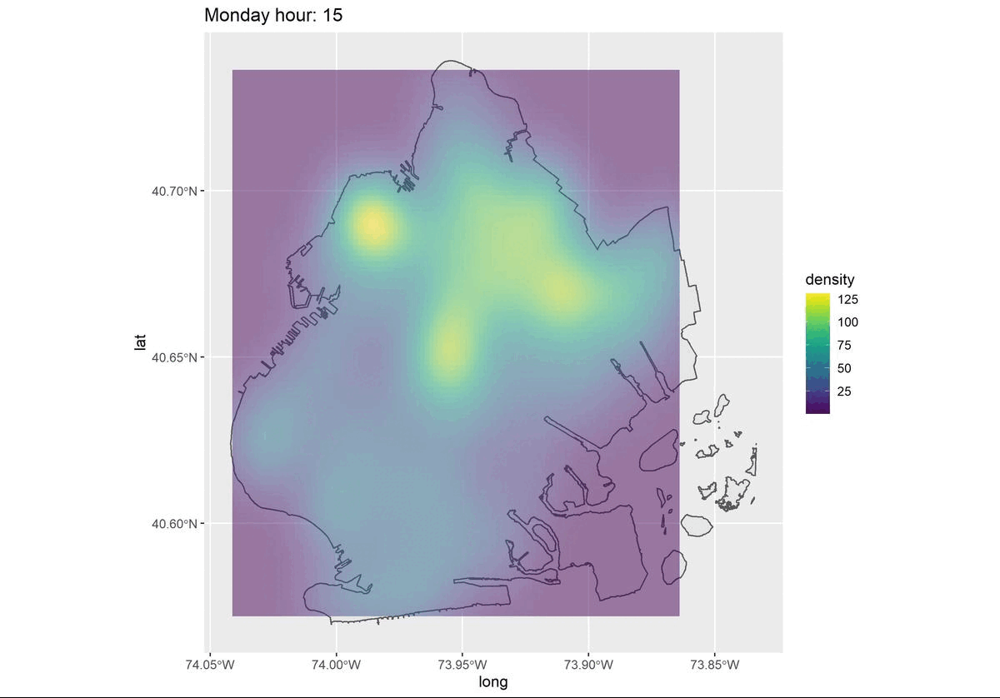

```

#### RTM 3pm

These are the results for 3pm 2007

Priority places as identified by RTM software
```{r, out.width = "50%", echo=FALSE, fig.align='center'}
options(knitr.graphics.error = FALSE)
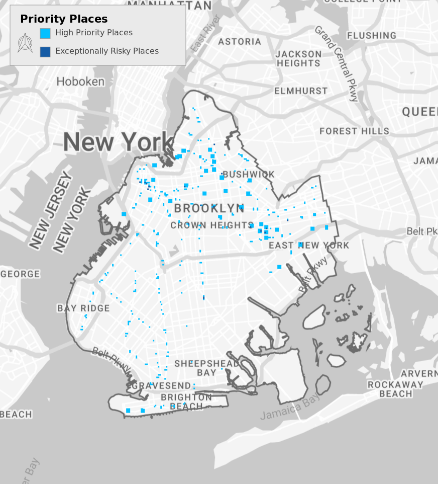
```

Relative risk as identified by RTM software
```{r, out.width = "50%", echo=FALSE, fig.align='center'}
options(knitr.graphics.error = FALSE)
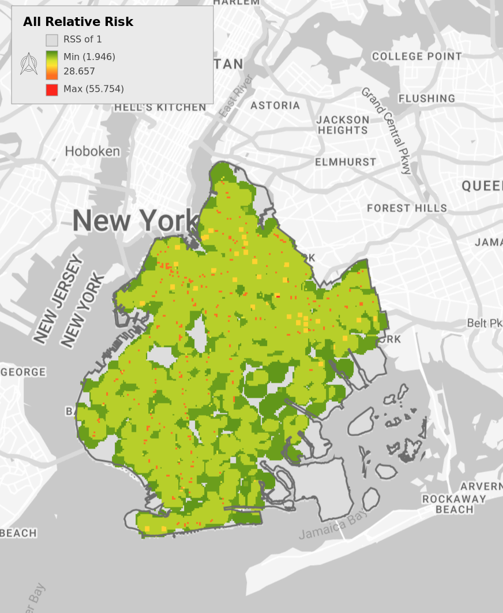
```

Above Average Risk places as identified by RTM software
```{r, out.width = "50%", echo=FALSE, fig.align='center'}
options(knitr.graphics.error = FALSE)
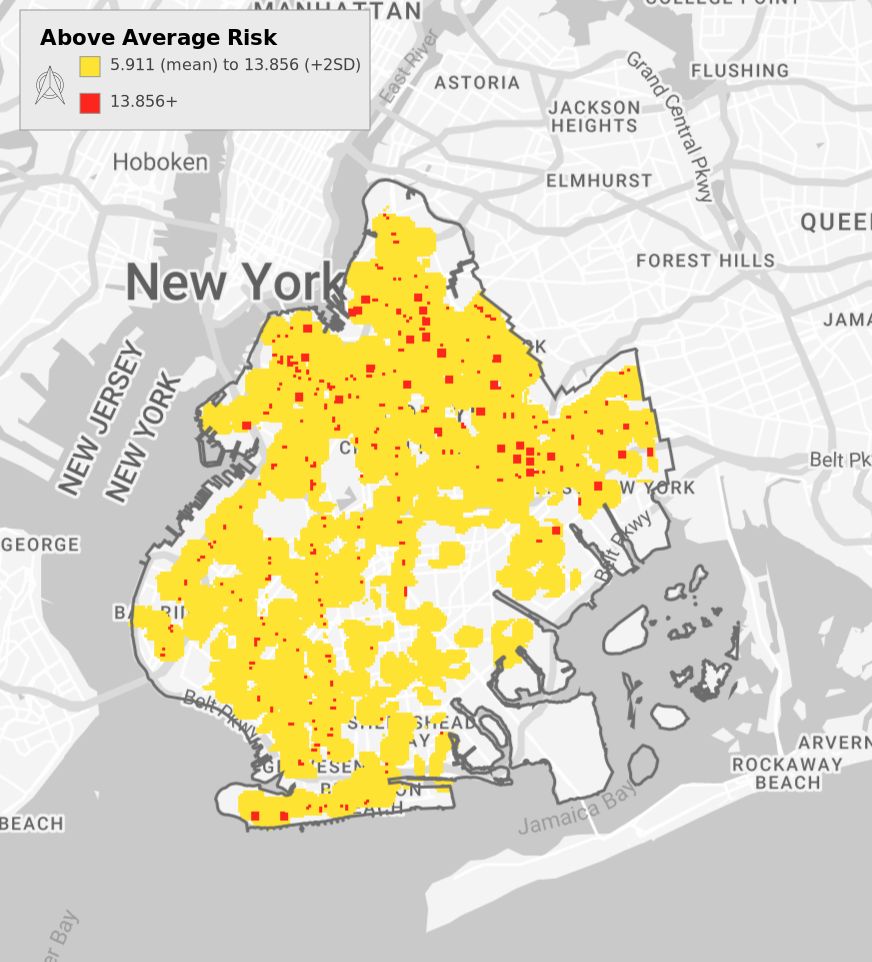
```

Highest Risk places as identified by RTM software
```{r, out.width = "50%", echo=FALSE, fig.align='center'}
options(knitr.graphics.error = FALSE)
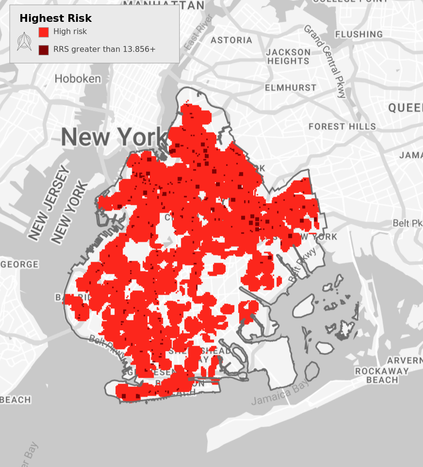
```


### Stop and Frisk data

Where do stops/frisks happen? Map through time.

#### 2007

```{r, out.width = "50%", echo=FALSE, fig.align='center'}
options(knitr.graphics.error = FALSE)
#knitr::include_graphics("figures/stopnfrisk/bk07scatterplot_heat.png")
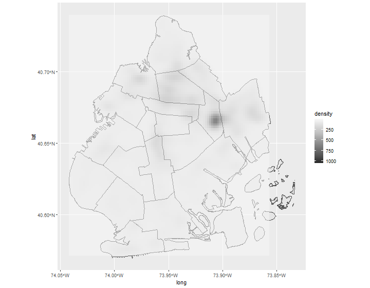

```

#### 2008

```{r, out.width = "50%", echo=FALSE, fig.align='center'}
options(knitr.graphics.error = FALSE)
#knitr::include_graphics("figures/stopnfrisk/bk08scatterplot_heat.png")
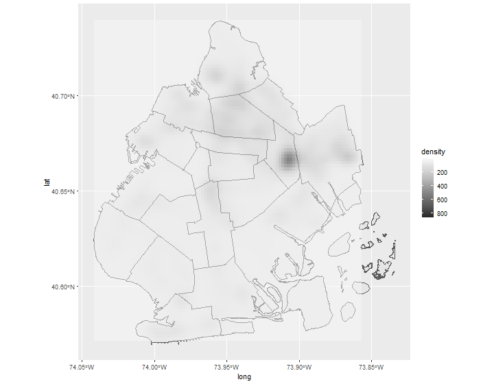

```

#### 2009

```{r, out.width = "50%", echo=FALSE, fig.align='center'}
options(knitr.graphics.error = FALSE)
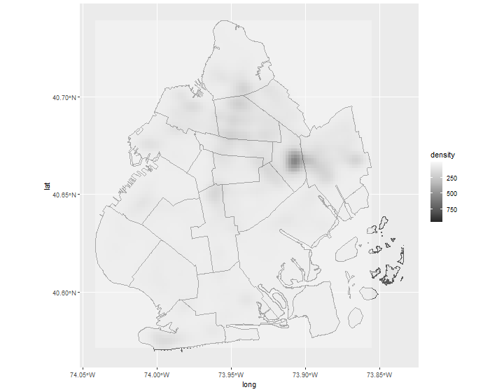
#knitr::include_graphics("figures/stopnfrisk/bk09scatterplot_heat.png")

```

#### 2010

```{r, out.width = "50%", echo=FALSE, fig.align='center'}
options(knitr.graphics.error = FALSE)
#knitr::include_graphics("figures/stopnfrisk/bk10scatterplot_heat.png")
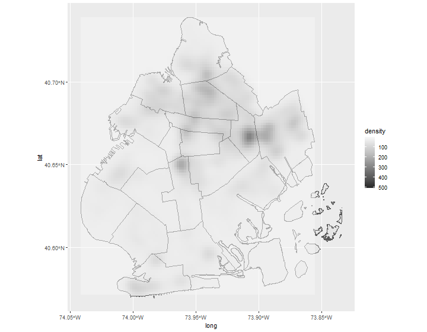

```

#### 2011

```{r, out.width = "50%", echo=FALSE, fig.align='center'}
options(knitr.graphics.error = FALSE)
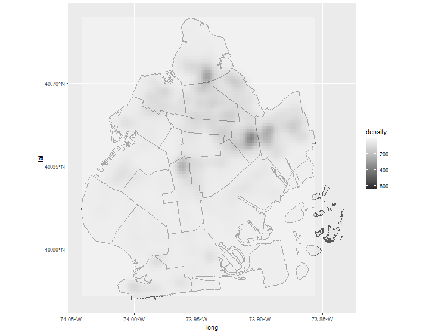
#knitr::include_graphics("figures/stopnfrisk/bk11scatterplot_heat.png")

```

#### 2012

```{r, out.width = "50%", echo=FALSE, fig.align='center'}
options(knitr.graphics.error = FALSE)
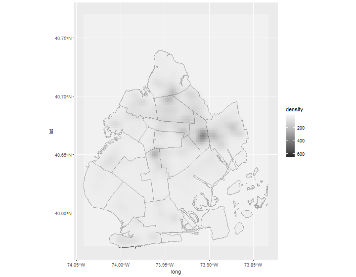
#knitr::include_graphics("figures/stopnfrisk/bk12scatterplot_heat.png")

```

#### 2013

```{r, out.width = "50%", echo=FALSE, fig.align='center'}
options(knitr.graphics.error = FALSE)
#knitr::include_graphics("figures/stopnfrisk/bk13scatterplot_heat.png")
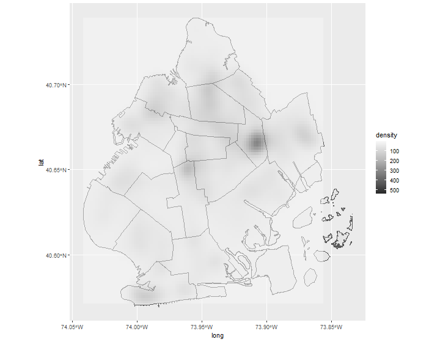

```

#### 2014

```{r, out.width = "50%", echo=FALSE, fig.align='center'}
options(knitr.graphics.error = FALSE)
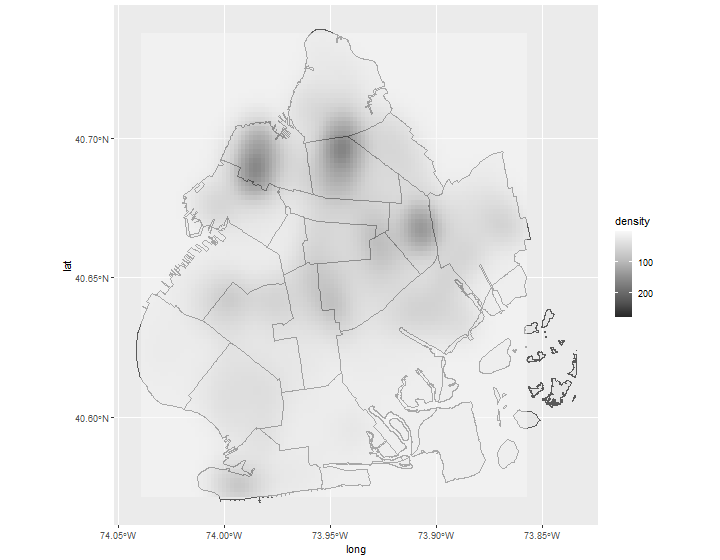
#knitr::include_graphics("figures/stopnfrisk/bk14scatterplot_heat.png")

```

#### 2015

```{r, out.width = "50%", echo=FALSE, fig.align='center'}
options(knitr.graphics.error = FALSE)
#knitr::include_graphics("figures/stopnfrisk/bk15scatterplot_heat.png")
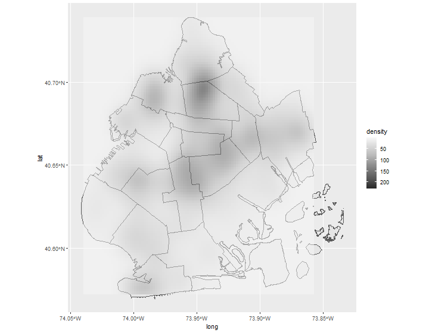

```

#### 2016

```{r, out.width = "50%", echo=FALSE, fig.align='center'}
options(knitr.graphics.error = FALSE)
#knitr::include_graphics("figures/stopnfrisk/bk16scatterplot_heat.png")
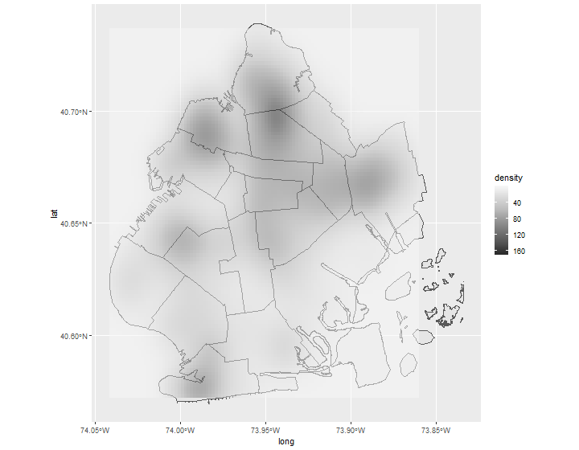

```

#### 2017-2018, 2020 TBD

#### 2019

```{r, out.width = "50%", echo=FALSE, fig.align='center'}
options(knitr.graphics.error = FALSE)
#knitr::include_graphics("figures/stopnfrisk/bk19scatterplot_heat.png")
knitr::include_graphics("figuresbk19scatterplot_heat.png")

```


